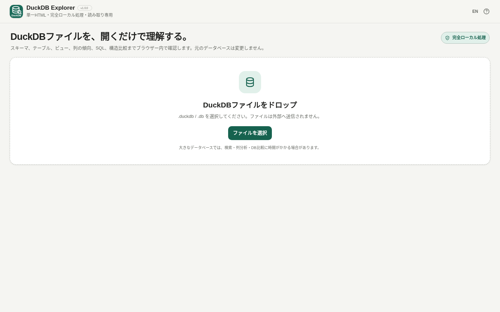

# DuckDB Explorer

[](https://github.com/ttomohisa/htmlapps-duckdb-explorer/actions/workflows/deploy-pages.yml)
[](LICENSE)
[](https://ttomohisa.github.io/htmlapps-duckdb-explorer/)

[English README](README.md)

ローカルのDuckDBデータベースファイルを読み取り専用で開き、構造や内容の確認、読み取り専用SQL、データ辞書HTML、DB構造比較を行う単一HTMLアプリです。選択したデータベースをサーバーへアップロードしません。

## 🚀 デモ

### [GitHub PagesでDuckDB Explorerを開く](https://ttomohisa.github.io/htmlapps-duckdb-explorer/)

GitHub Pagesから最初のHTMLを取得した後、選択したDuckDBファイルはHTML内に埋め込まれたDuckDB-Wasmでブラウザー内処理されます。アプリがデータベースファイルをアップロードすることはありません。

[](https://ttomohisa.github.io/htmlapps-duckdb-explorer/)

## 主な機能

- **データベース概要** — テーブルを開く前にschema、table、view、列数、推定行数、ファイルサイズ、DuckDBバージョンを確認
- **読み取り専用データ閲覧** — 100行ずつ、最初・前・次・最後のページへ移動、検索、列フィルタ、ソート、LIST / STRUCT / MAPなどの詳細表示
- **必要な列だけ分析** — NULL、ユニーク数推定、数値統計、日付範囲、文字列長、よくある値を明示操作で確認
- **読み取り専用SQL** — `SELECT` / `WITH` / `VALUES` / `SHOW` / `DESCRIBE` / `DESC` / `EXPLAIN`を1文ずつ実行。SELECT系結果は最大1,000行
- **データ辞書HTML** — DB構造、view定義、実行済み列分析を単一HTMLとして保存。テーブル行データは含めない
- **DB構造比較** — 2つのDuckDBファイルについてschema / table / view / 列定義 / view SQL / 推定行数の差分を比較。行単位diffは行わない
- **日本語 / 英語** — PC / スマートフォン対応
- **完全ローカル処理** — 配布HTMLに必要なruntimeを内包し、実行時CSPは`connect-src 'none'`

## すぐ使う

### Web版

[GitHub Pages版](https://ttomohisa.github.io/htmlapps-duckdb-explorer/)を開くだけで利用できます。インストールや登録は不要です。

### 正式リリースと同じ単一HTMLをビルドする

Windowsで以下を実行します。

```bat
build-standalone.bat
```

このリリース準備フローでは、

1. PowerShell構文とrepository contractを確認
2. 固定したnpm依存lockを検証
3. 2つのDuckDB回帰fixtureを生成
4. `ttomohisa/htmlapps-duckdb-wasm-builder` **v0.1.2 GitHub Release**から固定済み`explorer-minimal` artifactを取得
5. Release ZIPのSHA-256、matched API / EH Worker / WASMのSHA-256、Builder manifest、browser smoke test結果を再検証
6. `dist/index.html` / `dist/index.self-extract.html`を生成
7. 生成物が固定Builder runtimeを使用し、実行時外部通信を許可していないことを確認

まで行います。

取得するBuilder Release URLとSHA-256は[`duckdb-wasm-runtime.lock.json`](duckdb-wasm-runtime.lock.json)に固定しています。初回ビルド時は固定依存とBuilder Release artifactの取得にネットワークを使います。以後はcacheを再利用できます。

生成した`dist/index.html`は`file://`で直接開け、実行時はネットワーク接続なしで利用できます。

## 使い方

1. `.duckdb` / `.db` ファイルを選択またはドロップします。
2. 最初に**概要**でDB構造を確認します。
3. **一覧**からtableまたはviewを選択します。
4. 検索、filter、sort、cell詳細、**列**を必要に応じて使います。
5. 列分析は確認したい列だけ明示的に実行します。
6. **SQL**では読み取り専用SQLだけを実行します。
7. **概要**からデータ辞書HTMLの保存や別DBとの構造比較を行えます。

### CSV / JSON

データ閲覧からのCSV / JSON保存は、読み込みに成功した現在のページだけが対象です。ページ移動・検索・フィルタ・並べ替えの処理中、読み込み失敗後、該当行がない場合は保存できません。日本語と英語を切り替えても、読み込み状態やエラーを保持します。失敗した場合は一覧から同じテーブルやビューを選び直して再読み込みできます。巨大なテーブル全体を意図せずブラウザーのメモリへ展開しないための仕様です。検索・読み込み中はページ移動できません。JSON保存とレコード詳細では、`__proto__`などの列名や入れ子のキーも保持します。

### 読み取り専用SQL

SQL workspaceは1文ずつ実行します。`SELECT`、`WITH`、`VALUES`、`SHOW`、`DESCRIBE` / `DESC`、`EXPLAIN`を許可し、書き込み、DDL、ATTACH、extension読み込み、環境変更、複数statementなどはDuckDBへ渡す前に拒否します。DB自体もread-onlyで開きます。

SQL履歴はmemory-onlyで、別のDBを開くと消えます。

### データ辞書HTML

ファイル/DB概要、schema、table、view、列定義、view SQL、現在sessionで明示的に実行した列分析を含みます。テーブルの行データは含めません。

実行済み列分析の「よくある値」は含まれる場合があるため、外部共有前に内容を確認してください。

### DB構造比較

比較先DBは別の読み取り専用DuckDB-Wasm runtimeで一時的に開き、metadata取得後に解放します。行データの全件diffは行いません。

## DuckDB-Wasm runtimeの出所

正式リリースではWASMファイルだけを取り出してnpm版Workerなどと混ぜません。`htmlapps-duckdb-wasm-builder` v0.1.2が同一buildとして生成した以下のmatched setを使います。

- `duckdb-browser.cjs`
- `duckdb-browser-eh.worker.js`
- `duckdb-eh.wasm`

GitHub Release ZIP自体のSHA-256を固定し、展開後もBuilder manifest、verification、browser smoke test、manifest hash、3ファイルすべてのSHA-256を再確認してから埋め込みます。

このGitHubアクセスは**ビルド時だけ**です。完成したDuckDB Explorerの実行時通信方針は変わらず、`connect-src 'none'`です。

Builder開発時は`build-standalone.ps1 -DuckDBWasmArtifactDir ...`でローカルartifactを明示できますが、正式CIとGitHub Pagesは`prepare-release.ps1`経由で固定したGitHub Releaseを使用します。

## GitHub Pages

GitHub Pages workflowもローカル正式ビルドと同じ`prepare-release.ps1`を使うため、固定したBuilder Release runtimeで生成されます。

1. `ttomohisa/htmlapps-duckdb-explorer`へpushします。
2. **Settings → Pages → Build and deployment → Source**を**GitHub Actions**にします。
3. `main`へpushするか、Actionsからdeploy workflowを手動実行します。

詳細は[docs/GITHUB_PAGES.ja.md](docs/GITHUB_PAGES.ja.md)を参照してください。

## 開発・ビルド構成

```text
.
├─ src/index.template.html
├─ dependencies.json
├─ dependencies.lock.json
├─ duckdb-wasm-runtime.lock.json        # Builder Releaseとhashを固定
├─ build-standalone.bat                 # 正式版と同じWindows build入口
├─ build-standalone.ps1                 # 低レベル開発用build engine
├─ test-data/
├─ scripts/
│  ├─ prepare-release.ps1
│  ├─ fetch-duckdb-wasm-runtime.ps1
│  ├─ verify-custom-duckdb-wasm.ps1
│  └─ check-release.ps1
├─ assets/
│  ├─ favicon.svg
│  ├─ screenshot.png
│  └─ screenshot-en.png
└─ dist/
```

正式版確認・生成では`build-standalone.bat`を使ってください。内部では`prepare-release.ps1`を通り、固定したBuilder runtimeでbuildします。低レベルの開発用途では`build-standalone.ps1`を直接利用できます。

固定build inputを再取得する場合:

```bat
build-standalone.bat -ForceDownload
```

## プライバシー / 実行時通信

選択したDBファイル、検索文字列、filter、SQL、SQL履歴、query結果をアプリが外部serverへ送信しません。analytics / telemetryもありません。

実行時CSPは`connect-src 'none'`です。アプリ側で永続保存するのはUI言語設定だけです。

npmやBuilder GitHub Releaseからの取得はビルド時処理であり、ユーザーがDuckDBファイルを扱う実行時処理とは分離されています。

## 制限

- DuckDBファイルは編集しません。
- 閲覧画面のCSV / JSON保存は現在表示中のpageのみです。
- SELECT系SQL結果の表示/保存は最大1,000行です。
- DB比較は構造比較で、行単位の追加・更新・削除diffは行いません。
- 列分析は自動全列scanではなく、明示的に選んだ列だけです。
- データ辞書には明示実行した列分析の「よくある値」が含まれる場合があります。
- DuckDB version差やoptional extensionに依存するDBはブラウザー版で開けない場合があります。
- 大きなDBや重いview、検索、列分析、比較はCPU / memoryを多く使う場合があります。
- 主対象はChrome / Edgeです。Firefox / Safariはbest-effortです。

## 依存関係

| Library / runtime | Version | License | 用途 |
| --- | ---: | --- | --- |
| DuckDB-Wasm API baseline | 1.32.0 | MIT | ブラウザーAPI互換性 |
| `htmlapps-duckdb-wasm-builder` `explorer-minimal` | v0.1.2 | DuckDB-Wasm / DuckDB由来 | 正式版で使うmatched API / EH Worker / WASM |
| `apache-arrow` | 17.0.0 | Apache-2.0 | Arrow結果のbrowser-side処理 |

詳細は[THIRD_PARTY_NOTICES.md](THIRD_PARTY_NOTICES.md)を参照してください。

## リリース確認

正式リリース前は`build-standalone.bat -ForceDownload`を実行し、[RELEASE_CHECKLIST.md](RELEASE_CHECKLIST.md)に沿って確認します。offline回帰の詳細は[VERIFY_OFFLINE.md](VERIFY_OFFLINE.md)にあります。

## Contributing

bug report / feature proposalはGitHub Issuesで受け付けます。[CONTRIBUTING.md](CONTRIBUTING.md)を参照してください。

## License

Copyright © 2026 ttomohisa

[MIT License](LICENSE)

### 表示状態の回帰テスト

依存パッケージ不要の回帰テストにはNode.js 18以降を使います。リポジトリのルートで `node --test` を実行してください。`scripts/check-repository.ps1` もソースとルートのHTMLのテストを実行し、リリース検証では通常版HTMLと自己展開版の復元内容にも同じテストを実行します。リリース手順は通常版のビルド成果物を検証してからルートの `duckdb-explorer.html` にコピーし、更新後も検証します。古いルートのHTMLで再ビルドが妨げられないこと、検証失敗時に置き換えられないこともPowerShellでテストします。埋め込み用の定数だけを正規化したソースとの一致も検証します。小さな架空の行とDOM・クエリのテストダブルを使い、実データベースやブラウザーは使用しません。
