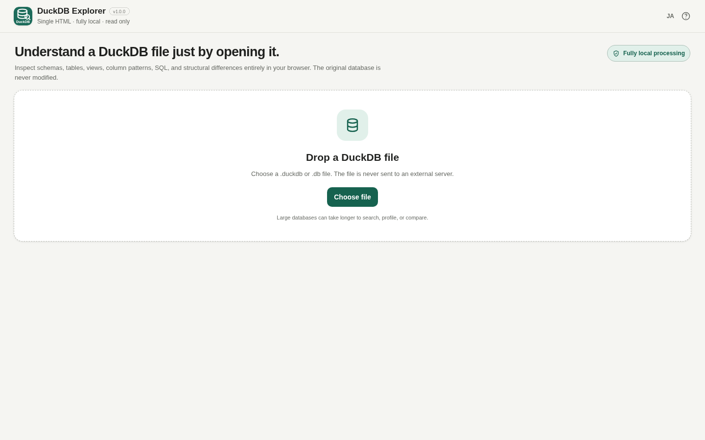

# DuckDB Explorer

[](https://github.com/ttomohisa/htmlapps-duckdb-explorer/actions/workflows/deploy-pages.yml)
[](LICENSE)
[](https://ttomohisa.github.io/htmlapps-duckdb-explorer/)

[日本語版 README](README.ja.md)

A read-only, single-HTML app for opening local DuckDB database files, inspecting their structure and contents, running guarded SQL, exporting a data dictionary, and comparing database structure without uploading the selected database to a server.

## 🚀 Live demo

### [Open DuckDB Explorer on GitHub Pages](https://ttomohisa.github.io/htmlapps-duckdb-explorer/)

GitHub Pages delivers the initial HTML. After it loads, the selected DuckDB file is registered with the embedded DuckDB-Wasm runtime and processed locally in the browser. The database file is not uploaded by the app.

[](https://ttomohisa.github.io/htmlapps-duckdb-explorer/)

## Features

- **Database overview** — Inspect schemas, tables, views, columns, estimated row counts, file size, and DuckDB version before opening a relation.
- **Read-only data browser** — Page through 100 rows at a time, search, filter, sort, and inspect nested LIST / STRUCT / MAP values without modifying the source database.
- **On-demand column analysis** — Run NULL counts, estimated distinct counts, numeric summaries, date ranges, text-length summaries, and common-value checks only when requested.
- **Guarded read-only SQL** — Run one `SELECT` / `WITH` / `VALUES` / `SHOW` / `DESCRIBE` / `DESC` / `EXPLAIN` statement at a time. SELECT-style results are capped at 1,000 rows.
- **Data dictionary HTML** — Export database structure, view definitions, and column profiles already computed during the current session. Table rows are not included.
- **Structural database comparison** — Compare schemas, tables, views, column definitions, view SQL, and estimated row-count changes between two local DuckDB files. Row-by-row data diff is intentionally out of scope.
- **Japanese / English UI** — Desktop and smartphone layouts are included.
- **Fully local runtime** — The distributed HTML contains the required runtime assets and uses a CSP with `connect-src 'none'`.

## Quick start

### Use the web demo

Open the [GitHub Pages demo](https://ttomohisa.github.io/htmlapps-duckdb-explorer/). No installation or account is required.

### Build the release-equivalent standalone HTML

On Windows:

```bat
build-standalone.bat
```

The release preparation flow:

1. validates PowerShell scripts and repository contracts,
2. verifies the pinned npm dependency lock,
3. generates the two DuckDB regression fixtures,
4. downloads the pinned `explorer-minimal` artifact from the `ttomohisa/htmlapps-duckdb-wasm-builder` **v0.1.2 GitHub Release**,
5. verifies the Release ZIP SHA-256 and the matched browser API / EH Worker / WASM hashes and browser-smoke record,
6. builds `dist/index.html` and `dist/index.self-extract.html`, and
7. verifies that the generated release contains the pinned Builder runtime and blocks runtime network connections.

The exact Builder Release URL and SHA-256 values are pinned in [`duckdb-wasm-runtime.lock.json`](duckdb-wasm-runtime.lock.json). The first release build needs network access to obtain pinned build dependencies and the Builder Release archive. Cached copies are reused on later builds.

After building, `dist/index.html` can be opened directly with `file://` and used without a network connection.

## Usage

1. Choose or drop a `.duckdb` / `.db` file.
2. Review **Overview** to understand the database structure without exact-counting every table.
3. Select a table or view from **Objects**.
4. Use search, filters, sorting, cell details, and the **Columns** view as needed.
5. Run column analysis only for columns you want to inspect.
6. Use **SQL** for guarded read-only statements.
7. From **Overview**, save a data dictionary HTML or compare another DuckDB file.

### Viewer export

CSV / JSON export from the data viewer saves only the current successfully loaded page. Export is unavailable while a page, search, filter, or sort request is pending, after a failure, or when no rows match. Switching Japanese/English preserves loading and error states. Select the relation again to reload after a failure. Nested values are serialized safely; CSV includes a UTF-8 BOM.

### Read-only SQL

The SQL workspace accepts one statement at a time and allows `SELECT`, `WITH`, `VALUES`, `SHOW`, `DESCRIBE` / `DESC`, and `EXPLAIN`. Write, DDL, attachment, extension-loading, environment-changing, and multi-statement SQL is rejected before execution. The database itself is also opened with DuckDB read-only access.

Query history is memory-only and is cleared when another database is opened.

### Data dictionary HTML

The generated report contains file/database summary information, schemas, tables, views, column definitions, view SQL, and column profiles that were explicitly run during the current session. It does not contain table rows.

Completed profiles may include common values, so review the report before sharing it.

### Structural comparison

The second database is opened in an isolated read-only DuckDB-Wasm runtime only long enough to read metadata. The comparison is structural; it does not perform exhaustive row-by-row data diffing.

## Release runtime provenance

The release build does **not** take only a WASM file and combine it with unrelated npm assets. It uses the matched set published by `htmlapps-duckdb-wasm-builder` v0.1.2:

- `duckdb-browser.cjs`
- `duckdb-browser-eh.worker.js`
- `duckdb-eh.wasm`

The GitHub Release archive is pinned by SHA-256. Its Builder manifest, verification record, browser smoke-test status, manifest hash, and the SHA-256 of all three runtime files are checked again before they are embedded.

The runtime download happens only during the build. The generated application itself still requires no external runtime connection and keeps `connect-src 'none'`.

For Builder development, `build-standalone.ps1` still accepts an explicit `-DuckDBWasmArtifactDir`, but official CI and GitHub Pages builds use `scripts/prepare-release.ps1`, which resolves the pinned GitHub Release artifact.

## GitHub Pages

The repository workflow builds the same pinned release runtime used by the local release flow and deploys `dist/` to GitHub Pages.

1. Push this repository as `ttomohisa/htmlapps-duckdb-explorer`.
2. Open **Settings → Pages → Build and deployment → Source** and select **GitHub Actions**.
3. Push to `main`, or manually run **Deploy standalone app to GitHub Pages**.

See [docs/GITHUB_PAGES.md](docs/GITHUB_PAGES.md).

## Development and build layout

```text
.
├─ src/index.template.html
├─ dependencies.json
├─ dependencies.lock.json
├─ duckdb-wasm-runtime.lock.json        # Pinned Builder Release + hashes
├─ build-standalone.bat                 # Canonical release-equivalent Windows build
├─ build-standalone.ps1                 # Low-level development build engine
├─ test-data/                           # Base + comparison fixtures
├─ scripts/
│  ├─ prepare-release.ps1
│  ├─ fetch-duckdb-wasm-runtime.ps1
│  ├─ verify-custom-duckdb-wasm.ps1
│  └─ check-release.ps1
├─ assets/
│  ├─ favicon.svg
│  ├─ screenshot.png
│  └─ screenshot-en.png
└─ dist/
```

`build-standalone.bat` is the canonical Windows build entry point and produces the release-equivalent standalone files with the pinned Builder runtime. The underlying `build-standalone.ps1` remains available for low-level development builds.

To force re-download of pinned build inputs:

```bat
build-standalone.bat -ForceDownload
```

## Privacy and runtime network protection

The selected database is processed inside the browser. The app does not upload database files, search text, filters, SQL text, query history, or SQL results.

The runtime CSP contains `connect-src 'none'`. There is no analytics or telemetry. The UI language preference is the only application preference persisted locally.

Build-time downloads from npm and the Builder GitHub Release are development/release operations and are separate from runtime processing of user files.

## Limitations

- The app is read-only and does not edit DuckDB files.
- Viewer CSV / JSON export is limited to the currently displayed page.
- SELECT-style SQL display/export is capped at 1,000 rows.
- Database comparison is structural and does not identify row-level inserts, updates, or deletes.
- Column profiling is on demand and does not automatically analyze every column.
- Data dictionary reports can include common values from profiles that were explicitly run.
- Databases that depend on incompatible DuckDB versions or optional extensions may not open in the browser build.
- Large databases, expensive views, searches, profiles, or comparisons can consume substantial memory/CPU.
- Chrome and Edge are the primary targets. Firefox and Safari are best-effort.

## Dependencies

| Library / runtime | Version | License | Purpose |
| --- | ---: | --- | --- |
| DuckDB-Wasm API baseline | 1.32.0 | MIT | Browser DuckDB API compatibility |
| `htmlapps-duckdb-wasm-builder` `explorer-minimal` | v0.1.2 | generated from DuckDB-Wasm/DuckDB | Matched browser API / EH Worker / WASM used by release builds |
| `apache-arrow` | 17.0.0 | Apache-2.0 | Arrow result decoding and browser-side data handling |

See [THIRD_PARTY_NOTICES.md](THIRD_PARTY_NOTICES.md).

## Release validation

Before tagging a release, run `build-standalone.bat -ForceDownload` and follow [RELEASE_CHECKLIST.md](RELEASE_CHECKLIST.md). Offline regression details are in [VERIFY_OFFLINE.md](VERIFY_OFFLINE.md).

## Contributing

Bug reports and feature proposals are welcome through GitHub Issues. See [CONTRIBUTING.md](CONTRIBUTING.md).

## License

Copyright © 2026 ttomohisa

Licensed under the [MIT License](LICENSE).

### Relation-state regression tests

Node.js 18 or later is required for the dependency-free regression tests. Run `node --test` from the repository root. `scripts/check-repository.ps1` also runs the source tests; release verification repeats them against the readable HTML and decompressed self-extract payload. The tests use small fictitious rows and DOM/query doubles, not a real database or browser.
